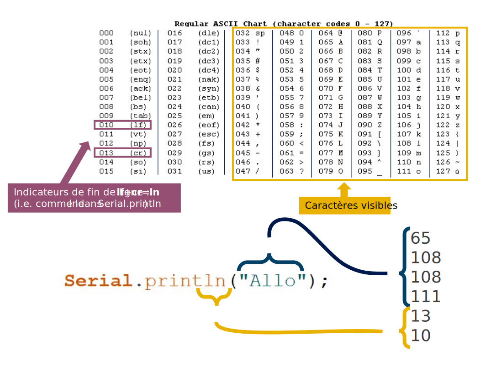

# Déboguer <!-- Titre de la section est écrit Déboguage plutôt que Débogage  -->

## Ouvrir et configurer le moniteur série


## Fonctions pour déboguer avec Serial


## Exemple d'envoi d'un message


## Le code ASCII utilisé pour le débogage



## Exemple : envoyer continuellement la valeur d'une entrée numérique

```arduino
int maBrocheEntreeNumerique = 4;

void setup() { // AU DÉMARRAGE
  Serial.begin(57600); // CONFIGURER LA COMMUNICATION SÉRIE
  pinMode( maBrocheEntreeNumerique , INPUT_PULLUP); // CONFIGURER LA BROCHE DE L'INTERRUPTEUR EN ENTRÉE
}

void loop() { // RÉPÉTER LE PLUS VITE POSSIBLE
  int maValeurInterrupteur = digitalRead( maBrocheEntreeNumerique ); // LECTURE DE TENSION

  Serial.print( maValeurInterrupteur ); // ENVOYER LA VALEUR
  Serial.println();  // TERMINER LE MESSAGE
}
```
