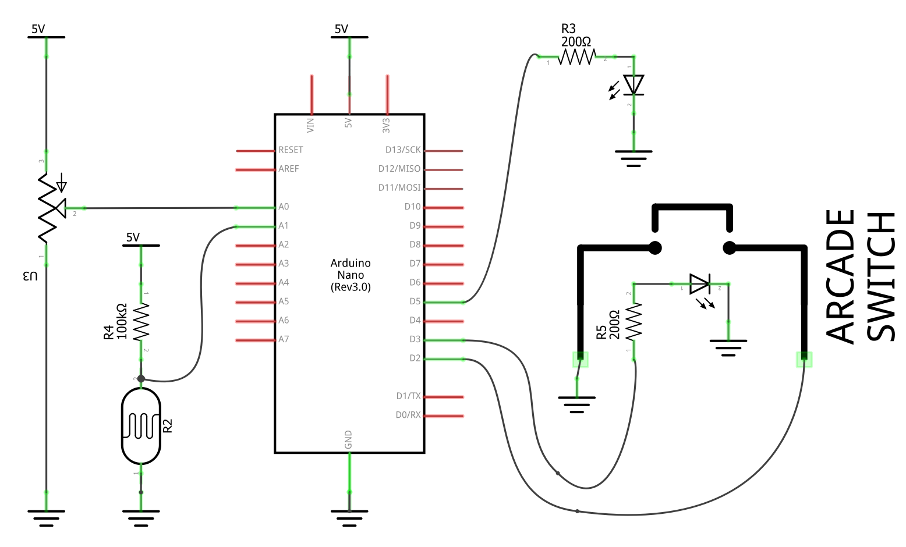

# Objectif final de cette ressource d'enseignement


## Description de l'objectif final

Toute la matière de centre ressource d'enseignement a été choisie et ordonnée pour diriger l'apprenant dans la réalisation de cet objectif final. Cet objectif est présenté ici, tout au début, pour donner un sens, une direction et une présentation de l'étendue des savoirs contenus dans cette ressource.


Cette REL propose une solution pour l'intégration de l'électronique aux espaces immersifs dans un contexte de création multimédia. C'est-à-dire l’intégration de capteurs et actionneurs dans un grand espace où l'ordinateur multimédia, qui doit coordonner les aspects audiovisuels (les projections visuelles, les éclairages, les effets et les diffusions sonores), est distant. 

La solution proposée essaie de rester peu onéreuse et accessible tout en demeurant fiable (en éliminant les sources d’erreurs potentielles des communications) et très compatible avec les outils de création multimédia.

À cette fin, l’environnement de développement choisi est Arduino, le modèle de carte l’Arduino Nano et le protocole de communication l’Open Sound Control (OSC).

À noter que cette documentation est entièrement compatible avec des cartes qui communiquent par Wi-Fi ou l'Ethernet comme l'ESP32. Les cartes Arduino ESP32 sont en effet à privilégier, mais un peu plus difficiles à maitriser. Elles seront intégrées à cette ressource ultérieurement.

## Connectique OSC de l'objectif final


## Circuit électronique de l'objectif final

### Illustration du circuit électronique


### Schéma du circuit éléctronique



## Code Arduino de l'objectif final

```arduino
{{#include osc_espace_immersif/osc_espace_immersif.ino}}
```